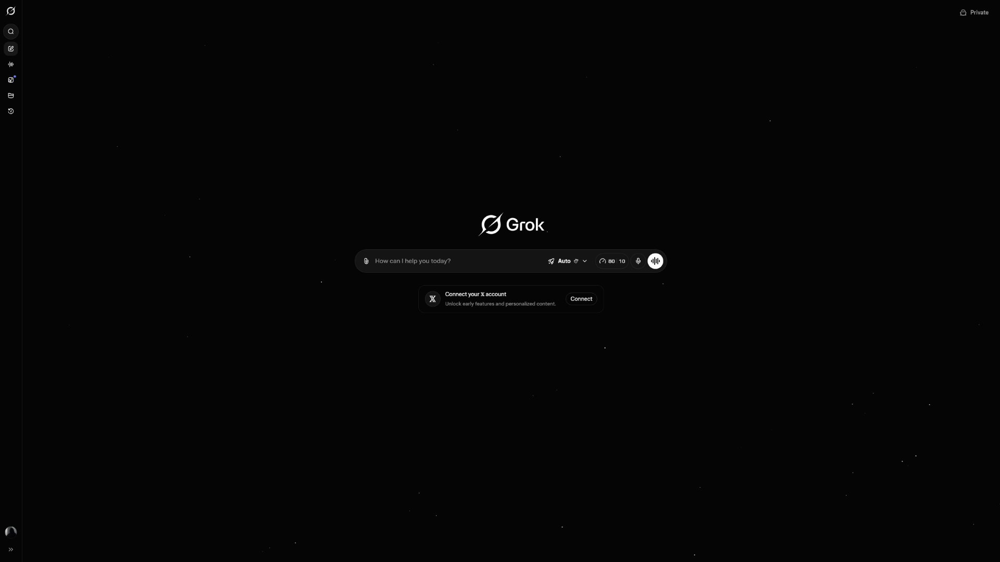
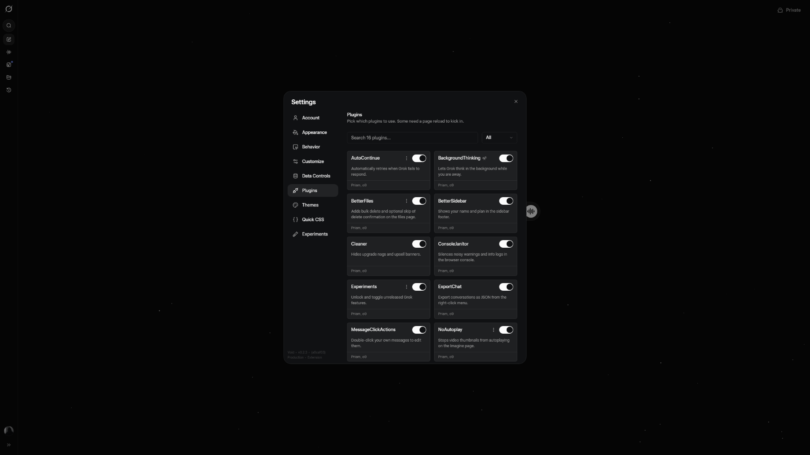
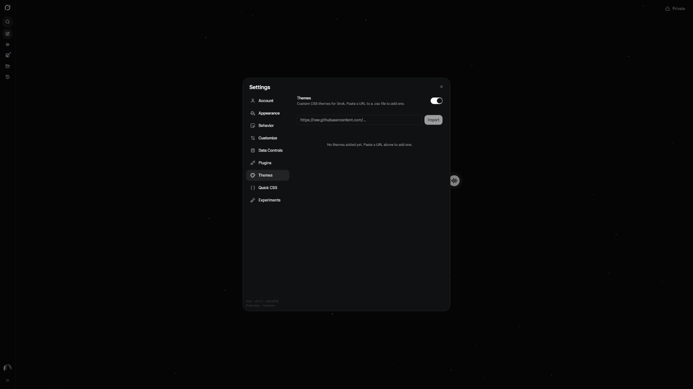
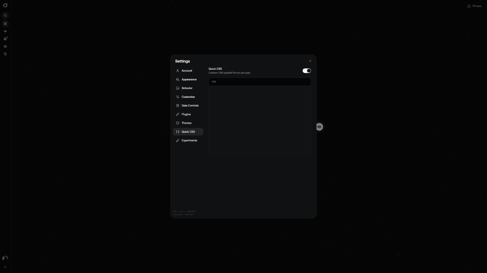
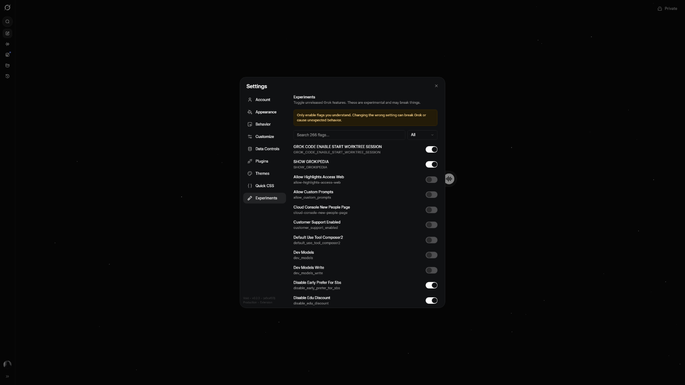

<h1 align="center">Void ⟡</h1>

<div align="center">
  
</div>

<div align="center">
  
  
</div>

<div align="center">
  
  
</div>

---

## About

[](LICENSE)
[](CONTRIBUTING.md)
[](https://github.com/9l9l/Void/stargazers)

A client-side modification for [Grok](https://grok.com), inspired by [Vencord](https://github.com/Vendicated/Vencord). Patches Grok's bundled code at runtime with a plugin system, custom CSS editor, and theme support. No server-side changes, no telemetry. Works as a userscript or browser extension.

## Installation

### Userscript

Install [Violentmonkey](https://violentmonkey.github.io/) or [Tampermonkey](https://www.tampermonkey.net/), then install the script from [Greasy Fork](https://greasyfork.org/en/scripts/567871-void).

### Browser Extension

**Chrome / Chromium** — Build with `bun run build`, go to `chrome://extensions`, enable Developer Mode, click "Load unpacked" and select the `dist/chrome-unpacked` folder.

**Firefox** — Build with `bun run build`, go to `about:debugging#/runtime/this-firefox`, click "Load Temporary Add-on" and select `dist/firefox-unpacked/manifest.json`.

## Building from Source

Requires [Bun](https://bun.sh/) >= 1.0.

```sh
git clone https://github.com/9l9l/Void.git
cd Void
bun install
bun run build
```

## Contributing

See [CONTRIBUTING.md](CONTRIBUTING.md).

## Disclaimer

Grok is a trademark of xAI Corp. and is mentioned here purely for descriptive purposes. This project is not affiliated with, endorsed by, or associated with xAI Corp. in any way.

<details>
<summary>Using Void violates Grok's Terms of Service</summary>

Client modifications like Void go against [xAI's Terms of Service](https://x.ai/legal/terms-of-service), which prohibit reverse engineering, modifying, or creating derivative works from the service.

There are currently no known cases of accounts being suspended for using client modifications on Grok. You should be fine as long as you stick to plugins that don't abuse or spam the platform. All built-in plugins are designed with this in mind.

That said, if losing access to your account would be a serious problem for you, consider not using any client modifications at all. This applies to Void and any similar tool.

</details>

## License

[GPL-3.0-or-later](LICENSE)
